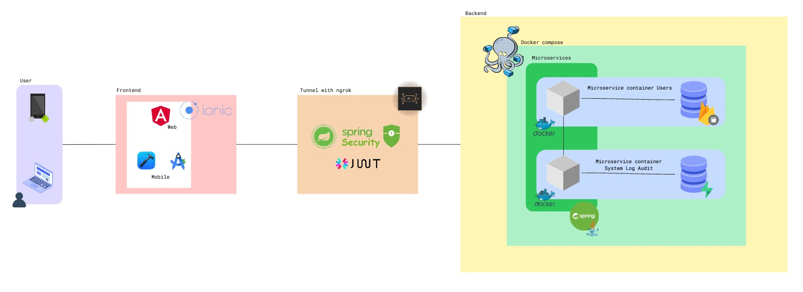
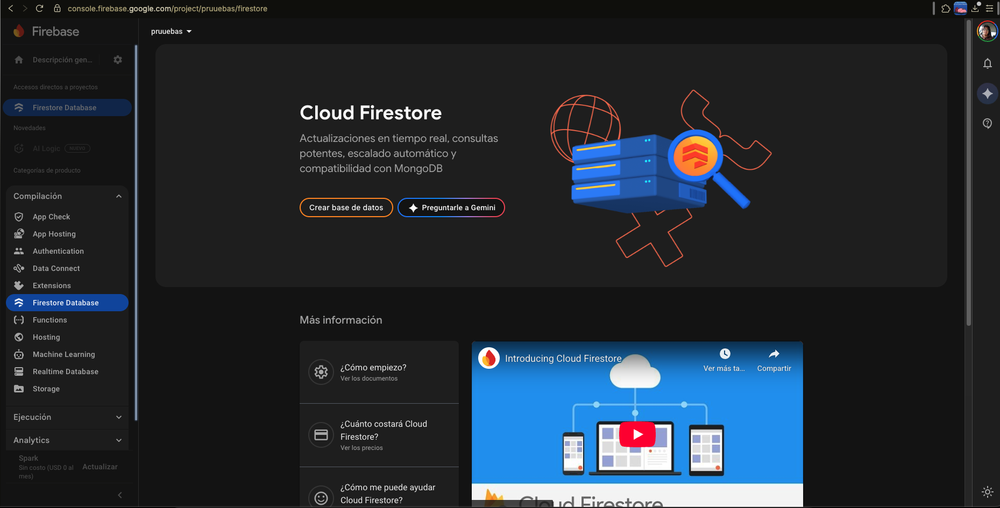
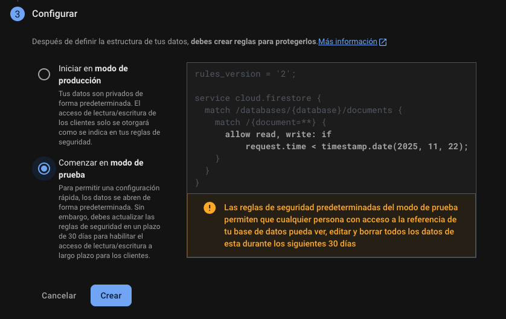
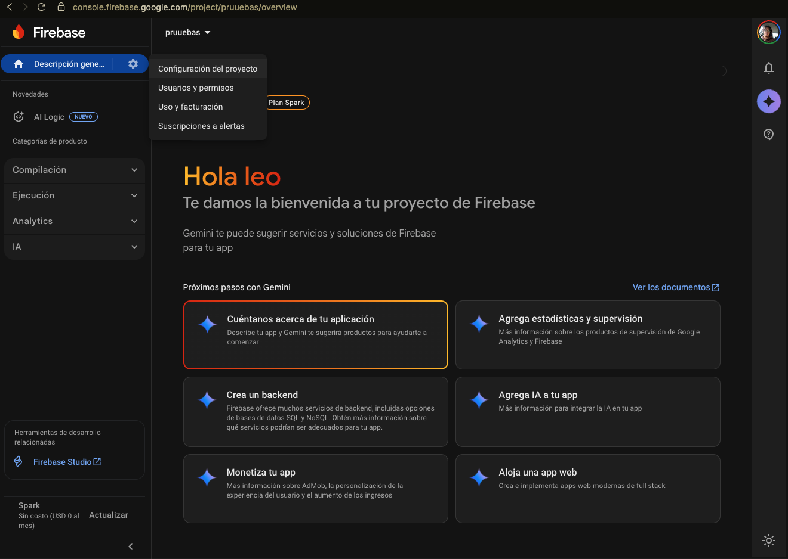
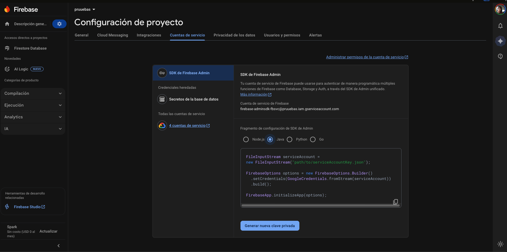
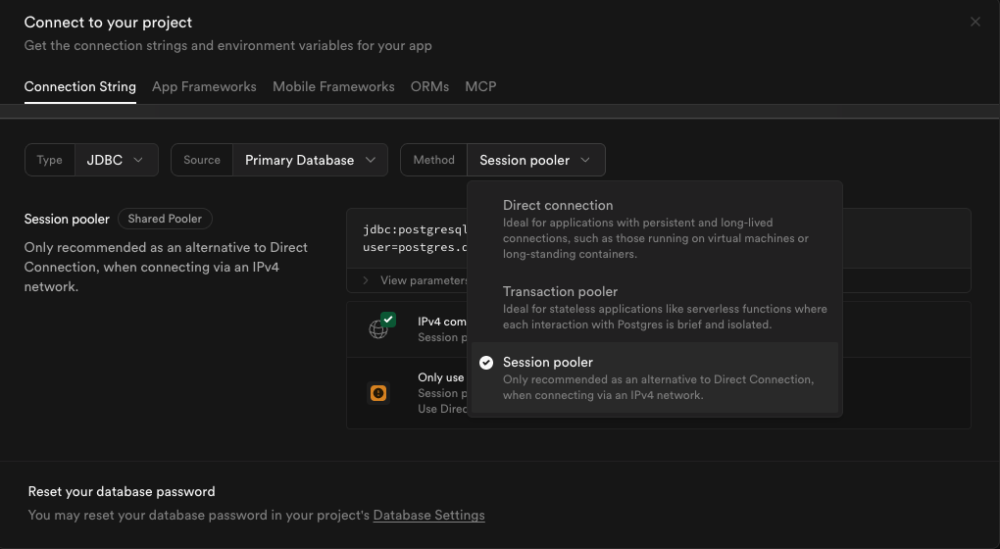
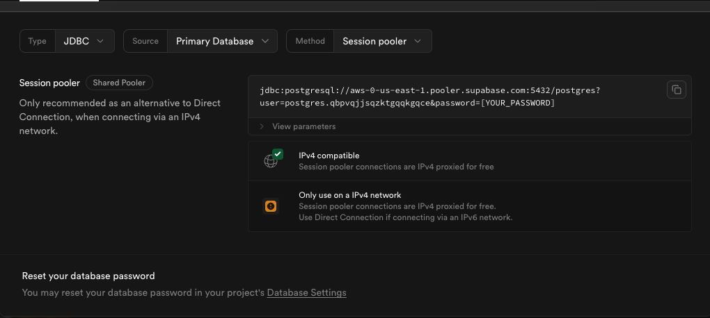
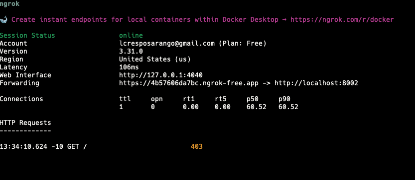

# App Full Stack para gestionar usuarios y auditoria de acciones mediante Firebase/Firestore y PostgreSQL/Supabase.
## Arquitectura del proyecto

Para la implementacion de la arquitectura se utilizo:
- Spring Boot junto con Java para el desarrollo de los microservicios.
- Docker Compose para la orquestacion de contenedores (cada microservicio en su propio contenedor).
- Firebase/Firestore para la gestion de usuarios
- PostgreSQL/Supabase como sistemas de gestion de datos.
- Ionic para la creacion de una aplicación completa en Angular con capacitor para la integracion en dispositivos mobiles.
- Tunnel NGROK para la creacion de un proxy local para la comunicacion entre el frontend y el backend.
- diferentes manejos de autenticacion (JWT, bycript para contraseñas)
## Obtencion de credenciales
Al ser un proyecto de ejemplo, no se incluyeron las credenciales de los servicios, ya que estos servicios estan alojados en la nube y son privados. Para obtener las credenciales, se deben seguir los siguientes pasos:
1. Crear un proyecto en Firebase y obtener las credenciales del servicio (archivo JSON).
    - Ir a la consola de Firebase: https://console.firebase.google.com
    - Crear un nuevo proyecto
    - Crea una base de datos en Firestore Database
      
    - Llenalo con los datos por defecto y en modo de pruebas
      
    - Luego debemos ir a la configuración del proyecto
      
    - Y en la pestaña de "Cuentas de servicio", generamos una nueva clave privada, ten encuenta elegir la opccion JAVA
      
    - Esto descargara un archivo JSON con las credenciales del servicio, el cual debe ser guardado en la ruta bajo el nombre (firebase-service-account.json) `./user/src/main/resources/firebase-service-account.json`
2. Obten el secreto JWT
    - Puedes generar un secreto JWT utilizando herramientas en línea o bibliotecas específicas. Asegúrate de que sea una cadena segura y compleja.
    - en este proyecto se obtuvo mediante el siguiente comando
        ```bash
        [Convert]::ToBase64String((1..32 | ForEach-Object { Get-Random -Minimum 0 -Maximum 256 }))
        ```      
        Este comando genera una cadena aleatoria de 32 caracteres, que se puede utilizar como secreto JWT, la terminal dara un resultado que debera ser copiado y pegado en el archivo `./.env` en la propiedad `JWT_SECRET`
        Puedes aplicar este enfoque para generar un secreto JWT segura.
3. Obtener el project id de tu proyecto de Firebase creado anteriormente
    - En la configuración del proyecto, en la pestaña "General", encontrarás el "ID del proyecto". Copia este valor.
    - Este valor debe ser pegado en el archivo `./.env` en la propiedad `FIREBASE_PROJECT_ID`
4. Configurar Supabase
    - Crea una cuenta en Supabase: https://supabase.com/
    - Crea un nuevo proyecto/organización
    - recuerda tu contraseña del proyecto ya que es la misma que se utilizá en la conexion JDBC
      
    - Recuerda que en Type debe ir JDBC y en method SESSION POOLER y copia la URL del JDBC en el archivo `./.env` en la propiedad `SUPABASE_JDBC_URL`
      
5. AUDIT_SERVICE_BASE_URL
    - Esta propiedad debe quedar tal cual en el archivo `./.env` ya que hace referencia al servicio de auditoria dentro de la red de docker compose.
    - `AUDIT_SERVICE_BASE_URL=http://second-stack-service:8003` - Referencia al segundo microservicio de auditoria.

Ten encuenta que estos pasos son necesarios para poder ejecutar el proyecto. Puedes Guiarte modificando el archivo `./.env.example` y copiando el contenido a `./.env`.

Más información dentro de los Readme de cada microservicio.
# Tunel NGROK
Para que la aplicacion movil pueda comunicarse con el backend, es necesario crear un tunel utilizando NGROK. Esto se debe a que la aplicacion movil no puede acceder a localhost directamente.
1. Descargar NGROK desde su sitio oficial: https://ngrok.com/download
2. Sigue los pasos de instalación y crea un tunel en torno al microservicio de usuarios `localhost:8002`
3. utiliza el siguiente comando necesario para la implementación del Tunel `ngrok http --host-header="localhost:8002" 8002` (Aplicalo en la terminal)
Tendras este resultado:

Copia el link que aparece en la terminal (forwarding) y lo utilizalo en los enviroments del Frontend.
# Guia de uso
## Backend
Se creo un archivo `docker-compose-yaml` dentro del directorio raiz para que el despleigue sea mas facil.

Se aplicaro metodos como health checker para que el backend se inicie solo cuando todos los servicios esten listos.
```javascript
healthcheck:
    test: [ "CMD-SHELL", "curl -fsS http://127.0.0.1:8003/actuator/health | grep -q '\"status\":\"UP\"'" ]
    interval: 20s
    timeout: 5s
    retries: 5
    start_period: 40s
```
Para mayor informacion consulta el archivo `DOCKER_GUIDE.md` 
## Frontend
