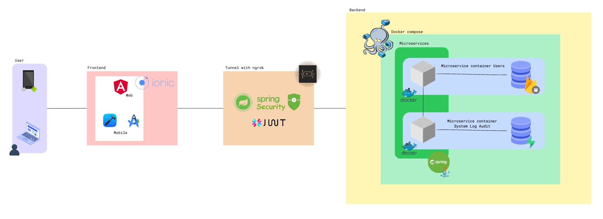
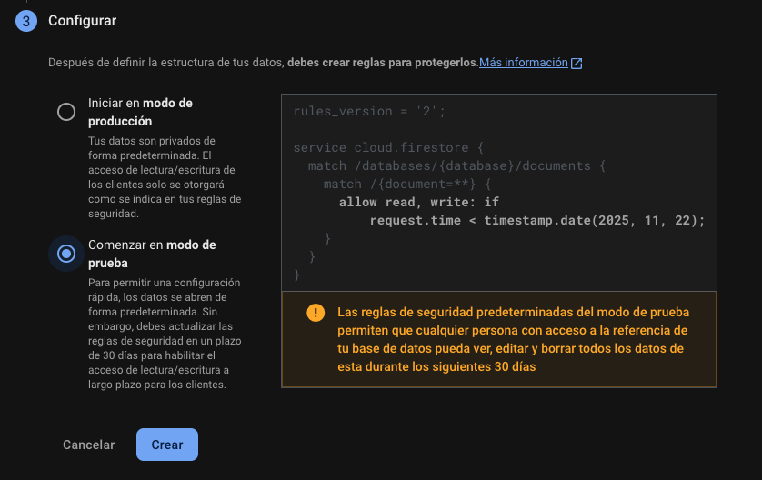
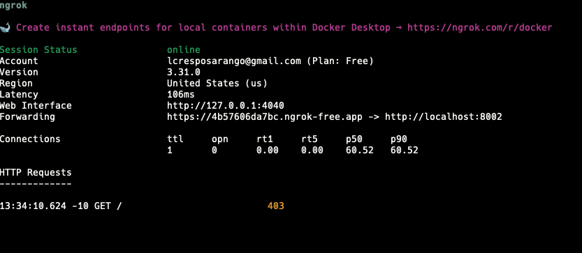

# App Full Stack para gestionar usuarios y auditoría de acciones mediante Firebase/Firestore y PostgreSQL/Supabase

## Arquitectura del proyecto



Para la implementación de la arquitectura se utilizó:

* Spring Boot junto con Java para el desarrollo de los microservicios.
* Docker Compose para la **orquestación** de contenedores (cada microservicio en su propio contenedor).
* Firebase/Firestore para la **gestión** de usuarios.
* PostgreSQL/Supabase como sistemas de gestión de datos.
* Ionic para la creación de una aplicación completa en Angular con Capacitor para la **integración** en dispositivos móviles.
* Túnel **ngrok** para la creación de un proxy local para la comunicación entre el frontend y el backend.
* Diferentes manejos de autenticación (JWT, **bcrypt** para contraseñas).

## Obtención de credenciales

Al ser un proyecto de ejemplo, no se incluyeron las credenciales de los servicios, ya que estos servicios están alojados en la nube y son privados. Para obtener las credenciales, se deben seguir los siguientes pasos:

1. Crear un proyecto en Firebase y obtener las credenciales del servicio (archivo JSON).

    * Ir a la consola de Firebase: [https://console.firebase.google.com](https://console.firebase.google.com)
    * Crear un nuevo proyecto.
    * Crear una base de datos en **Firestore Database**.
      
    * Llenarla con los datos por defecto y en modo de pruebas.
      
    * Luego, ir a la configuración del proyecto.
      
    * En la pestaña **“Cuentas de servicio”**, generar una nueva clave privada. Ten en cuenta elegir la opción **JAVA**.
      
    * Esto descargará un archivo JSON con las credenciales del servicio, el cual debe ser guardado en la ruta, bajo el nombre `firebase-service-account.json`:
      `./user/src/main/resources/firebase-service-account.json`

2. Obtener el secreto JWT

    * Puedes generar un secreto JWT utilizando herramientas en línea o bibliotecas específicas. Asegúrate de que sea una cadena segura y compleja.
    * En este proyecto se obtuvo mediante el siguiente comando:

      ```bash
      [Convert]::ToBase64String((1..32 | ForEach-Object { Get-Random -Minimum 0 -Maximum 256 }))
      ```

      Este comando genera una cadena aleatoria de 32 bytes codificada en Base64, que se puede utilizar como secreto JWT. La terminal dará un resultado que **deberá** ser copiado y pegado en el archivo `./.env` en la propiedad `JWT_SECRET`.
      Puedes aplicar este enfoque para generar un secreto JWT **seguro**.

3. Obtener el **Project ID** de tu proyecto de Firebase creado anteriormente

    * En la configuración del proyecto, en la pestaña **“General”**, encontrarás el **“ID del proyecto”**. Copia este valor.
    * Este valor debe ser pegado en el archivo `./.env` en la propiedad `FIREBASE_PROJECT_ID`.

4. Configurar Supabase

    * Crea una cuenta en Supabase: [https://supabase.com/](https://supabase.com/)
    * Crea un nuevo proyecto/organización.
    * **Recuerda** tu contraseña del proyecto ya que es la misma que se utilizará en la conexión JDBC.
      
    * En **Type** debe ir **JDBC** y en **Method** **SESSION POOLER**. Copia la URL JDBC en el archivo `./.env` en la propiedad `SUPABASE_JDBC_URL`.
      

5. `AUDIT_SERVICE_BASE_URL`

    * Esta propiedad debe quedar tal cual en el archivo `./.env` ya que hace referencia al servicio de auditoría dentro de la red de Docker Compose.
    * `AUDIT_SERVICE_BASE_URL=http://second-stack-service:8003` — Referencia al segundo microservicio de auditoría.

Ten en cuenta que estos pasos son necesarios para poder ejecutar el proyecto. Puedes guiarte modificando el archivo `./.env.example` y copiando el contenido a `./.env`.

Más información dentro de los README de cada microservicio.

# Túnel ngrok

Para que la aplicación móvil pueda comunicarse con el backend, es necesario crear un túnel utilizando **ngrok**. Esto se debe a que la aplicación móvil no puede acceder a `localhost` directamente.

1. Descargar **ngrok** desde su sitio oficial: [https://ngrok.com/download](https://ngrok.com/download)
2. Sigue los pasos de instalación y crea un túnel hacia el microservicio de usuarios `localhost:8002`.
3. Utiliza el siguiente comando para la implementación del túnel:

   ```bash
   ngrok http --host-header="localhost:8002" 8002
   ```

   Tendrás este resultado:
   

Copia el enlace que aparece en la terminal (**forwarding**) y utilízalo en los **environments** del frontend.

# Guía de uso

## Backend

Se creó un archivo `docker-compose.yml` dentro del directorio raíz para que el **despliegue** sea más fácil.

Se aplicaron métodos como **healthcheck** para que el backend se inicie solo cuando todos los servicios estén listos.

```yml
healthcheck:
  test: [ "CMD-SHELL", "curl -fsS http://127.0.0.1:8003/actuator/health | grep -q '\"status\":\"UP\"'" ]
  interval: 20s
  timeout: 5s
  retries: 5
  start_period: 40s
```

Para mayor información, consulta el archivo `DOCKER_GUIDE.md`.

## Frontend

Ten a la mano la URL del túnel que generaste en el paso 3 de la sección anterior.

**Cópiala** en los archivos `src/environments/environment.ts` y `src/environments/environment.prod.ts`:

```javascript
export const environment = {
  production: false,
  apiUrl: 'https://ecc233eae7a8.ngrok-free.app/users'
};
```

Cambia `https://ecc233eae7a8.ngrok-free.app` por la URL que generaste con ngrok, **manteniendo el sufijo** `/users` al final.

Al ser una aplicación de **Ionic**, se deberá iniciar mediante el comando:

```bash
ionic serve
```

Para dispositivos móviles se deberá ejecutar:

```bash
npx cap sync android   # o: npx cap sync ios
npx cap run android    # o: npx cap run ios
```

Ante dudas, consulta la documentación oficial de Ionic/Capacitor: [https://capacitorjs.com/docs/android](https://capacitorjs.com/docs/android) o el archivo `README.md` dentro del repositorio del frontend.

En esta prueba se aplicó con Android Studio para móviles Android.

# Documentación

## Backend

Se aplicó documentación mediante **Swagger UI**. Para mayor información de los controladores, puedes visualizar esta documentación en:

* [http://localhost:8002/swagger-ui/index.html](http://localhost:8002/swagger-ui/index.html)
* [http://localhost:8003/swagger-ui/index.html](http://localhost:8003/swagger-ui/index.html)

## Frontend

Se aplicó documentación mediante **Compodoc**. Para mayor información de los componentes, puedes visualizar:

```bash
# Generar documentación estándar
npx compodoc -p tsconfig.doc.json

# Servir con live reload en http://localhost:8080
npx compodoc -p tsconfig.doc.json -s -w
```

Ante dudas, consulta la documentación oficial de Compodoc: [https://compodoc.app/guides/getting-started.html](https://compodoc.app/guides/getting-started.html) o el archivo `README.md` dentro del repositorio del frontend.

# Extras

* Aplicación de empaquetador de archivos (frontend) mediante **pnpm** para mayor **seguridad** de dependencias y versiones, utilizando reglas de tiempo.
* Gestión de roles por parte del backend (**ADMIN, CUSTOMER, MANAGER**) y gestión de permisos por rol.
* El administrador tiene su propio componente **único** para gestionar usuarios, mientras que el usuario solo puede visualizar el **dashboard**.
* Seguridad mediante **JWT**.
* Autenticación **móvil** mediante **biometría**.
* Autenticación web mediante **TOTP**.
* Autenticación mediante Firebase/Firestore con usuario y contraseña.
* El backend crea un usuario **admin** por defecto para poder utilizar la aplicación sin problemas.

# Conclusiones

Este proyecto es un ejemplo de una arquitectura de microservicios de alto nivel.

Cada acción descrita tiene un **propósito**, y cada microservicio tiene una **responsabilidad** clara.

El manejo de URLs y APIs locales supone un problema para el uso de dispositivos **móviles**; por ende, se aplicó un túnel ngrok para poder comunicarse con el backend. A la vez, esto funciona con la plataforma web, ya que es un conector seguro entre **ambas** partes y no será necesario buscar una IP local para que los dispositivos móviles funcionen.

Se **orquestó** el despliegue de los microservicios mediante Docker Compose, para que los servicios sean **independientes entre sí** y no sean dependientes unos de otros; adicionalmente, para que el despliegue sea más **fácil**.

Se aplicó documentación mediante Swagger UI y Compodoc para mayor facilidad de uso.

# Tecnologías

## Frontend

<div align="left">
  
  
  
  
  
  
  
</div>

## Backend

<div align="left">
  
  
  
  
  
  
  
  
  
</div>
